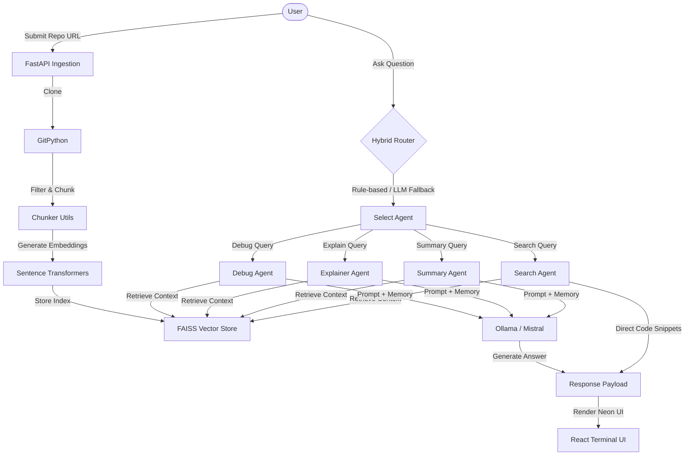

# AI Codebase Explainer (Multi-Agent + RAG + Memory)

An AI-powered developer assistant that clones any public GitHub repository, builds a local semantic index, and enables conversational query processing via a **Multi-Agent RAG architecture**—all running completely locally and privately.

---

## 🏗️ Architecture Overview

The system processes source code using a multi-agent framework paired with Retrieval-Augmented Generation (RAG) and conversational memory.



### Key Components

1. **Ingestion & Processing Pipeline:** Clones GitHub repositories using `GitPython`, filters out binary/non-essential files, splits files into line-based code chunks or paragraph-based text chunks, and parses `.ipynb` (Jupyter Notebook) files.
2. **Local Vector Store:** Generates semantic embeddings with SentenceTransformers (`all-MiniLM-L6-v2`) and indexes them locally with `FAISS` for fast cosine-similarity searches.
3. **Hybrid Query Router:** Analyzes the user query using high-speed keyword heuristics, falling back to LLM intent classification if needed, to route queries to the correct specialized agent.
4. **Specialized Agents:**
   - **Explainer Agent:** Handles architecture, design, and code logic walkthroughs.
   - **Debug Agent:** Concentrates on exceptions, bugs, tracebacks, and fixes.
   - **Summary Agent:** Provides high-level documentation summaries and overview guides.
   - **Search Agent:** Conducts precise substring searches across retrieved chunks for quick code locating.
5. **Short-Term Conversational Memory:** Maintains the context of the last **3 interactions** to support multi-turn dialogues and follow-up requests.

---

## 🛠️ Tech Stack

- **Backend:** FastAPI, Python, Ollama (Mistral 7B), FAISS, SentenceTransformers
- **Frontend:** React (Vite), Tailwind CSS, Custom Monospace/Hacker UI

---

## 🚀 Getting Started

Follow these steps to set up and run the AI Codebase Explainer on your machine.

### Prerequisites

- **Python 3.10+**
- **Node.js 18+** & **npm**
- **Ollama** installed and running locally

### 1. Ollama Setup

First, download and start the local LLM of choice (Mistral is default):

```bash
# Pull the Mistral model
ollama pull mistral

# Start the Ollama server (if not already running in the background)
ollama serve
```

### 2. Backend Setup

Navigate to the `backend` folder and configure a virtual environment:

```bash
cd backend

# Create virtual environment
python -m venv .venv

# Activate virtual environment
# On Windows:
.venv\Scripts\activate
# On macOS/Linux:
source .venv/bin/activate

# Install dependencies
pip install -r ../requirements.txt

# Run the FastAPI server
python -m uvicorn app:app --reload --port 8000
```

The API will now be running on `http://127.0.0.1:8000`.

### 3. Frontend Setup

In a new terminal window, navigate to the `frontend` folder and run the React app:

```bash
cd frontend

# Install Node modules
npm install

# Start development server
npm run dev
```

Open **`http://localhost:5173`** in your browser to view the retro terminal UI!

---

## 📂 Project Structure

```text
├── backend/
│   ├── app.py                  # API entry point & CORS configuration
│   ├── routes/
│   │   └── repo.py             # Ingestion & query endpoint routing
│   ├── services/
│   │   ├── repo_service.py     # Git cloning & local repo management
│   │   ├── processing_service.py # Core file chunker orchestrator
│   │   ├── embedding_service.py# SentenceTransformers vector generation
│   │   ├── vector_store.py     # FAISS search operations
│   │   └── llm_service.py      # Ollama/Mistral client wrapper
│   ├── agents/
│   │   ├── router_agent.py     # Rule-based + LLM query routing
│   │   ├── explainer_agent.py  # Code explanations
│   │   ├── debug_agent.py      # Error pinpointing & code fixing
│   │   ├── summary_agent.py    # Repo/file structure summarizations
│   │   └── search_agent.py     # Substring file finder
│   ├── utils/
│   │   ├── chunker.py          # Paragraph and line window generators
│   │   ├── file_reader.py      # Multi-format reader (.ipynb, .py, etc.)
│   │   └── file_filter.py      # Extension/size exclusions
│   └── repos/                  # Ingested repos directory (clones stored here)
│
├── frontend/
│   ├── src/
│   │   ├── components/
│   │   │   ├── RepoInput.jsx   # GitHub URL input & cloning trigger
│   │   │   ├── ChatWindow.jsx  # Main scrollable dialogue viewport
│   │   │   ├── ChatMessage.jsx # Message renderer with custom formatting
│   │   │   └── QueryInput.jsx  # Bottom query console input
│   │   ├── services/
│   │   │   └── api.js          # Fetch wrapper talking to FastAPI
│   │   ├── App.jsx             # Shell container & session management
│   │   └── index.css           # Global terminal neon styles & scrollbars
│
├── requirements.txt            # Python dependencies list
└── PROGRESS.md                 # Daily building-in-public development log
```

---

## 🧠 Current Status & Roadmap

The current build is at **Day 6 (operational & stable)**, providing terminal-style UI output rendering, agent classification, semantic search, and memory.

### Next Steps / Future Work
- [ ] **FAISS Index Persistence:** Save and load indexes from disk rather than rebuilding on restart.
- [ ] **AST-Based Chunking:** Incorporate Abstract Syntax Tree chunk parsing for language-aware chunk boundaries.
- [ ] **Streaming Responses:** Support server-sent events (SSE) for real-time token generation in the React terminal.
- [ ] **Authentication & Private Repos:** Add GitHub personal access token authentication.
